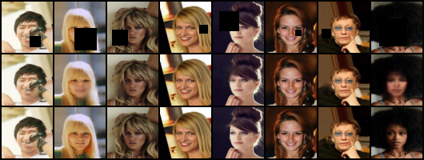
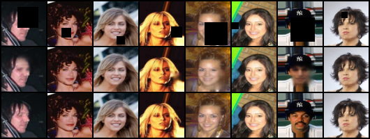
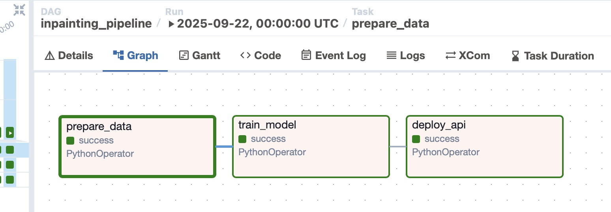

# Face Inpainting Pipeline with U-Net and Apache Airflow

This repository contains a full end-to-end pipeline for **image inpainting** on human faces using a U-Net-based deep learning model. The pipeline is orchestrated using **Apache Airflow** and containerized with **Docker Compose**.

---

## Overview

The pipeline performs the following steps:

1. **Data Preparation**: Resizes and masks face images.
2. **Model Training**: Trains a U-Net model for image inpainting.
3. **Model Deployment**: Deploys the trained model using Docker Compose.

---

## Project Structure


```
celeba-inpainting/
├── airflow/
│   ├── dags/
│   │   └── inpainting_pipeline.py     # Airflow DAG definition
│   ├── airflow.cfg                    # Airflow config
│   └── webserver_config.py           # Airflow web UI setup
├── code/
│   ├── prepare_data.py               # Data preprocessing script
│   ├── models/
│   │   ├── train.py                  # Training loop
│   │   └── unet.py                   # U-Net model definition
│   └── deployment/
│       ├── api/app.py                # FastAPI app for serving
│       └── app/streamlit_app.py      # Optional: Streamlit UI
├── data/
│   ├── raw/                          # Raw images (CelebA or sample)
│   └── processed/                    # Resized, split dataset
├── models/
│   └── inpainting_unet.pt            # Saved model checkpoint
├── results/
│   └── debug_batch.png               # Training debug outputs
├── airflow.db                        # Airflow metadata DB
├── docker-compose.yml               # For serving API
├── Dockerfile.api                   # FastAPI image
├── Dockerfile.app                   # Streamlit app image
└── README.md
```

---

## 📷 Sample Results




---

## 🔄 Airflow Pipeline

The training pipeline is orchestrated using Airflow DAG with the following stages:

1. **prepare_data** — loads and processes raw images
2. **train_model** — trains U-Net on masked face images
3. **deploy_api** — builds and launches Docker container

Airflow DAG screenshot:



---

## ⚙️ How to Run

### 1. Clone and Install

```bash
git clone https://github.com/yourname/celeba-inpainting.git
cd celeba-inpainting
pip install -r requirements.dev.txt
```

### 2. Prepare Data

Place images in `data/raw/` or use CelebA subset.

### 3. Run Airflow

```bash
cd airflow
export AIRFLOW_HOME=$(pwd)
airflow db init
airflow users create \
    --username admin --password admin \
    --firstname A --lastname A \
    --role Admin --email admin@example.com
airflow scheduler &
airflow webserver --port 8080
```

Open `http://localhost:8080` and trigger the DAG: `inpainting_pipeline`.

---

## 📦 Deployment

After successful training, the `deploy_api` task launches the Dockerized FastAPI app:

```bash
docker compose up -d --build
```

The API will be available at `http://localhost:8000`.

---

## 📈 Training Details

- Model: Custom U-Net
- Dataset: CelebA
- Input Size: 64x64
- Optimizer: Adam
- Loss: Binary Cross Entropy + Masked MSE

---